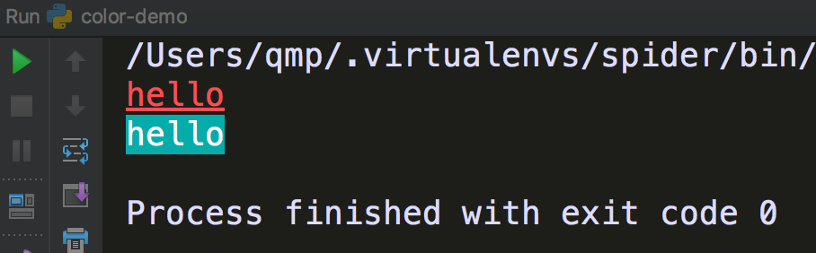

consolecolor
============

设置pycharm控制台字体颜色

快速开始
========

安装：

::

    pip install consolecolor

使用：

.. code:: python

    from consolecolor import FontColor, Colors

    print(FontColor.set_color("hello", Colors.red, underline=True))
    print(FontColor.set_backcolor("hello", Colors.blue))

显示效果： |显示|

项目详细说明：
`Python编程：pycharm控制台字体颜色 <https://blog.csdn.net/mouday/article/details/79152994>`__

